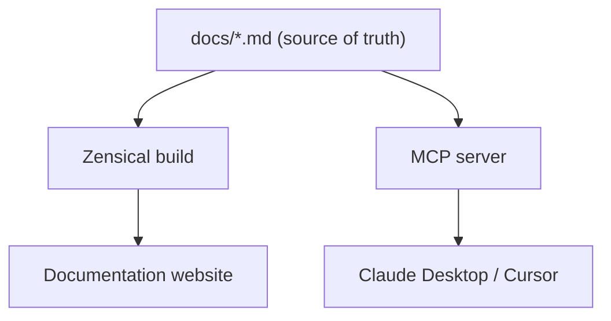
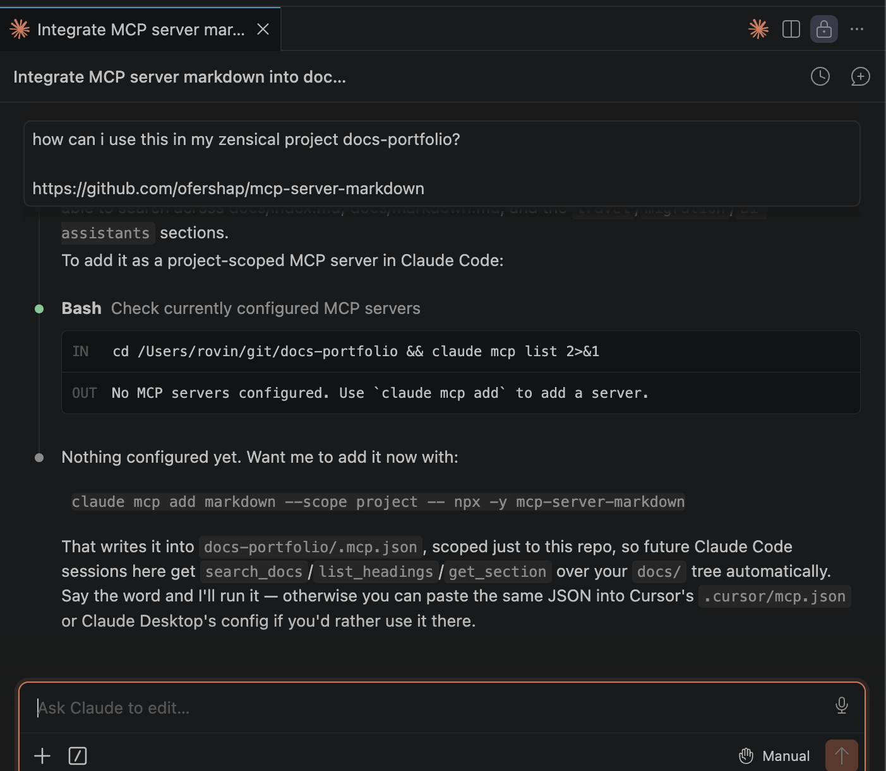
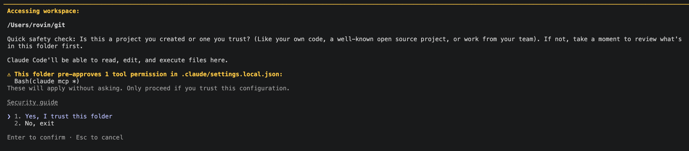
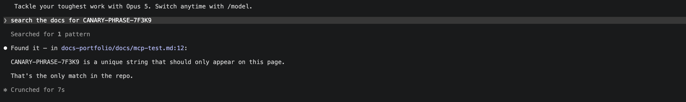

# Building an MCP Server for a Docs-as-Code Site: Wiring Zensical Up to Claude and Cursor

AI assistants can answer questions about documentation, but they don't necessarily have access to the current version of those docs — only whatever they were trained on, or whatever gets pasted into the chat. I wanted to see whether MCP could close that gap for a docs-as-code site, so I built a small server that indexes this site's Markdown source directly and exposes it through two tools, `search_docs` and `get_page`, to MCP clients like Claude Desktop and Cursor.

[Part 1](intro.md) made the case for why that live connection matters in the first place, instead of a stale snapshot or a guess from training data. This post is the build: a running instance, not a diagram — an actual MCP server sitting on top of the [Zensical scaffold](../migration/zensical-deep-dive.md) from the migration series, the validation pass it went through before any custom code was written, and what broke along the way.

---

## How the pieces fit together

`docs/` is the shared source of truth. Zensical builds it into the site people read; the MCP server indexes the same files and hands them to whichever assistant asks.



## What Zensical already gives you to work with

The [Zensical deep dive](../migration/zensical-deep-dive.md) covered the stock `zensical new` scaffold: Markdown source in `docs/`, config in `zensical.toml`, and a `zensical build` step that produces a static `site/` directory — including a `search/` folder holding the index for Zensical's own in-browser search. That search is built by Disco, the Rust-backed engine Zensical wrote to replace the older Lunr.js-based search, and its index format isn't published or documented as something external tools are meant to read.

So that's not the integration point this project depends on. The Markdown files in `docs/` are the actual source of truth — Zensical builds the site from them, and the MCP server below indexes them directly instead of Zensical's build output. That keeps the server's behavior independent of whatever Disco's index format looks like today or turns into later.

## Why build this instead of reaching for an existing plugin

Part 1 named two existing projects worth knowing about: [`docusaurus-plugin-mcp-server`](https://github.com/scalvert/docusaurus-plugin-mcp-server) and the [MkDocs Search MCP server](https://www.npmjs.com/package/@serverless-dna/mkdocs-mcp). Neither targets Zensical. That's the gap this post fills, not a case of reinventing something that already exists for this tool.

## Proving the pattern works before writing any code

Before building anything custom, it's worth doing the cheapest possible version of this test: point an off-the-shelf Markdown MCP server at this repo and confirm the *pattern* (assistant, MCP server, real doc content) works end to end. [`mcp-server-markdown`](https://github.com/ofershap/mcp-server-markdown) is a small npm package that exposes `search_docs`, `get_section`, `list_headings`, and a few other tools over whatever `.md` files sit in its working directory. No custom code, no indexing step to write.

The ask, straight to Claude Code itself, since it's already sitting in this repo:



Registered it as a project-scoped server with Claude Code's own CLI, so it only runs inside this repo:

```
claude mcp add markdown --scope project -- npx -y mcp-server-markdown
```

That writes a `.mcp.json` into the repo root. Project-scoped servers need a one-time trust prompt the next time Claude Code starts in the folder:



To prove the server was actually being queried and not just answering from context, I dropped a throwaway page into `docs/` with a random, unguessable string — `CANARY-PHRASE-7F3K9` — that couldn't exist anywhere in the assistant's training data or the current conversation:

```markdown
## Canary Phrase

CANARY-PHRASE-7F3K9 is a unique string that should only appear on this page.
```

Then asked the assistant to find it, with nothing more specific than "search the docs":



It came back with the exact file and line number, proof the tool call actually hit the filesystem rather than pattern-matching the string from the prompt. That's the whole test: not a benchmark, just confirmation that an assistant with an MCP connection into `docs/` can find something a plain model call has no way to know.

With the pattern confirmed, the rest of this post is about the purpose-built version: one that understands Zensical's frontmatter and slug structure instead of treating `docs/` as a flat pile of Markdown.

## Deciding what the server actually exposes

Two tools, kept deliberately narrow, in keeping with the "scoped retrieval" principle from Part 1:

- **`search_docs`** — takes a query, returns matching page titles, descriptions, and slugs. Not full page text; that keeps a search call cheap.
- **`get_page`** — takes a slug returned by `search_docs` and returns that page's raw Markdown.

The design held. What I underestimated was how much the tool *description* matters, more on that below.

## The build

TypeScript, the official [`@modelcontextprotocol/sdk`](https://www.npmjs.com/package/@modelcontextprotocol/sdk), stdio transport (both Claude Desktop and Cursor spawn MCP servers as local subprocesses over stdio, no hosting needed for this to work locally).

Three moving pieces:

**1. Index the Markdown source, not the build output.** Walk `docs/`, parse frontmatter with `gray-matter`, strip Markdown syntax down to plain text, and feed it to [MiniSearch](https://www.npmjs.com/package/minisearch) — a small, dependency-light full-text index that runs in-process with no external service.

**2. `search_docs`.** Runs a MiniSearch query with prefix and light fuzzy matching, returns the top N results as title/description/slug, not the full page. If nothing matches, it returns a plain "no results" message instead of an empty array, so the assistant doesn't have to guess what silence means.

**3. `get_page`.** Looks up the slug in the in-memory doc list and returns the raw Markdown file straight from disk (not the stripped search text) so the assistant gets headings, code blocks, and links intact.

```ts
// src/index.ts (excerpt)
const DOCS_ROOT = process.env.ZENSICAL_DOCS_DIR ?? "./docs";

function loadDocs(): DocEntry[] {
  const files = walk(DOCS_ROOT, DOCS_ROOT);
  return files.map((file) => {
    const raw = readFileSync(file, "utf8");
    const { data, content } = matter(raw);
    const slug = relative(DOCS_ROOT, file)
      .replace(/\.md$/, "")
      .replace(/\\/g, "/")
      .replace(/\/index$/, "");
    return {
      id: slug || "index",
      title: data.title ?? slug,
      description: data.description ?? "",
      text: stripMarkdown(content),
      path: file,
    };
  });
}

const index = new MiniSearch<DocEntry>({
  idField: "id",
  fields: ["title", "description", "text"],
  storeFields: ["title", "description", "id"],
});
index.addAll(loadDocs());
```

The tool registration is where the design choice from Part 1 actually gets enforced, not by code but by the description the model reads before deciding whether to call the tool at all:

```ts
{
  name: "search_docs",
  description:
    "Search this documentation site for pages relevant to a query. " +
    "Returns titles, descriptions, and slugs — not full page text. " +
    "Use get_page to fetch a specific page's content once you know " +
    "which one you need. Prefer this over answering from general " +
    "knowledge for any question about this project's specific " +
    "configuration, commands, or behavior."
}
```

That last sentence isn't decoration. Without it, Claude will happily answer a docs question from training data or a guess and never call the tool at all. The tool being *available* doesn't mean the model reaches for it. The description is the only lever you have over that decision.

## Wiring it to the deploy pipeline

There isn't much wiring to do, because the server reads `docs/` directly rather than Zensical's `site/` build output. A doc edit that's merged to `main` is already "live" for the server the moment the file exists on disk: no separate index-regeneration step in CI.

The tradeoff is that the index is built once, in memory, when the server process starts. For local use through Claude Desktop or Cursor, both tools spawn a fresh subprocess per session, so a restart of the assistant picks up doc changes. In practice, that's rarely more than one stale session. For a hosted version (Part 3's territory, once auth is in place), a doc edit won't reach the server until the process restarts, so "restart after deploy" becomes a real step in that pipeline rather than something that just happens on its own.

## Pointing Claude Desktop and Cursor at the finished server

Config for Claude Desktop (`claude_desktop_config.json`):

```json
{
  "mcpServers": {
    "zensical-docs": {
      "command": "node",
      "args": ["/absolute/path/to/mcp-zensical/dist/index.js"],
      "env": { "ZENSICAL_DOCS_DIR": "/absolute/path/to/site/docs" }
    }
  }
}
```

Cursor uses the same shape in `.cursor/mcp.json` (project-level) or its global MCP settings. It's the same config shape as the `mcp-server-markdown` test earlier, just pointed at `dist/index.js` instead of `npx -y mcp-server-markdown`. The canary-phrase test from that section is the one to rerun against this server to confirm it behaves the same way — this post shows the configuration, not a second round of screenshots against the custom tool set.

## What broke

- **A no-match query returning nothing.** MiniSearch's default `search()` returns an empty array on no hits. That reads to the model as "the tool ran and found nothing to say," not "try a different query." Fixed by returning an explicit message instead of an empty result.
- **Windows-style path separators leaking into slugs.** `relative()` on Windows returns backslashes; left alone, slugs came out as `migration\zensical-deep-dive` instead of `migration/zensical-deep-dive`, which then didn't match what `search_docs` told the model to pass to `get_page`. Normalized with a `.replace(/\\/g, "/")`.
- **Full-page dumps from `get_page` on longer docs.** Some of the migration series deep dives are long. Returning the entire raw Markdown file works but isn't cheap on tokens for a page someone only wanted one section of. Not fixed yet. A real next step is letting `get_page` accept an optional heading/anchor and return just that section.
- **Staleness after a doc edit**, covered above under deploy wiring, not really "broke," but the "just works" framing needed correcting.

## Try it yourself

The Zensical scaffold this post builds on is public: [github.com/zeanrovin/zensical-example](https://github.com/zeanrovin/zensical-example). Clone it, register `mcp-server-markdown` against its `docs/` the same way shown above, and point your assistant at it.

## What's next

Building a working MCP server answers "can an assistant reach the docs." It doesn't answer "should every engineer's assistant be able to reach *all* of them."

What this build showed: MCP can hand an assistant current documentation straight from the repo, using the same Markdown source that feeds the docs site. Narrow tools — `search_docs` and `get_page` — give the assistant scoped retrieval instead of the whole `docs/` tree dumped into context on every turn. Retrieval turns out to be the easy problem. Part 3 is the one worth having before this pattern spreads past one docs site: once the documentation isn't all meant to be public, authentication and access control become the real question.

---

> This is part of a follow-up series to the [docs-as-code migration series](../migration/intro.md).
>
> - [Part 1: Why Your Documentation Is Invisible to AI Assistants](intro.md)
> - **Part 2: Building an MCP Server for a Docs-as-Code Site** ← you are here.
> - Part 3: Access Control for Docs-as-Code MCP Servers, coming soon.