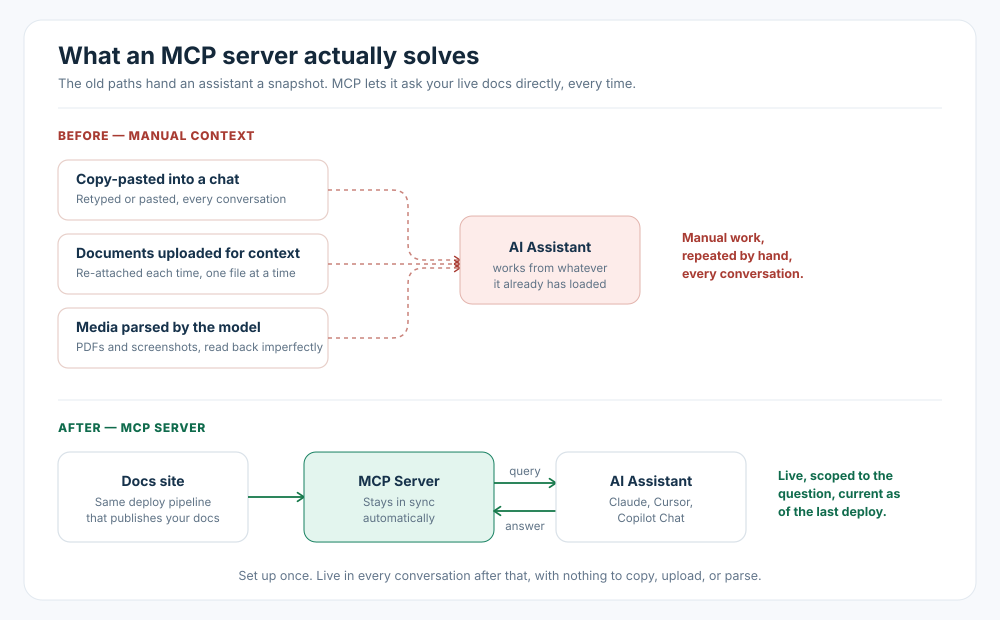

# Why Your Documentation Is Invisible to AI Assistants (And What to Do About It)

Getting documentation in front of an AI assistant is usually a manual job: copy a page into the chat, upload a PDF, drag in a screenshot. An MCP server replaces all of that with a direct, live connection between the assistant and the docs. Instead of you handing it context, it asks for what it needs.

## What it solves

**No copy-pasting.** The assistant queries the docs directly instead of someone finding the right page and pasting it into the conversation by hand.

**No uploading documents for context.** There's nothing to attach. The connection is already there at the start of every conversation, not re-added one file at a time.

**No parsing uploaded media.** A PDF or a screenshot has to be parsed into text before a model can use it, and that's a step where content gets mangled or dropped. An MCP server serves the documentation directly from the source, so there's nothing to parse in the first place.

All three are the same underlying problem: getting documentation into an assistant's context has been manual, repeated for every conversation. An MCP connection makes it a standing pipe instead of a one-off chore.

## What's Next

Part 2 is a hands-on build: an actual MCP server wired on top of the Zensical scaffold from the [deep-dive series](../migration/zensical-deep-dive.md) (the same tool this site itself runs on), tested with real queries against the real docs on this site, screenshots included.

---

> This is a follow-up to the [docs-as-code migration series](../migration/intro.md).
>
> - **Part 1: Why Your Documentation Is Invisible to AI Assistants** ← you are here.
> - [Part 2: Building an MCP Server for a Docs-as-Code Site](building-an-mcp-server.md) (hands-on).
