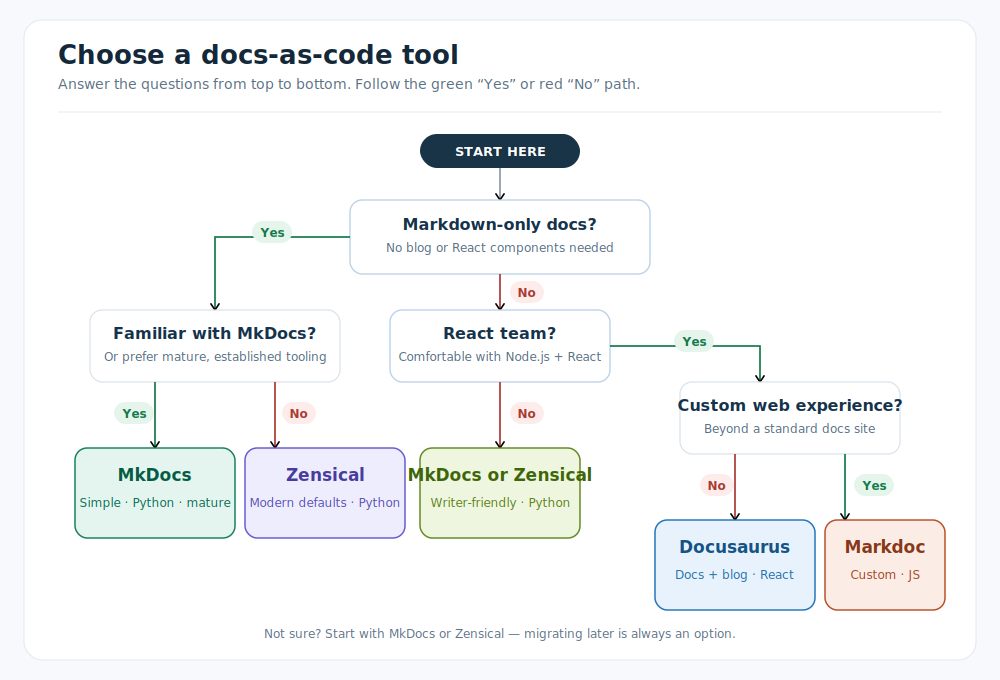

<section class="hero" aria-labelledby="page-title">
  

    
zeanrovin / writing, docs &amp; other things I make

    <h1 class="hero-line" id="page-title">
      Hi! I'm <strong>Rovin</strong>
      👋
      — I help teams turn
      📄
      messy docs into ones people actually
      📖
      read :)
    </h1>
    

      <a class="btn btn-solid reveal" style="--d:8" href="mailto:zeanrovinb@icloud.com">Get in touch</a>
      <a class="btn btn-ghost reveal" style="--d:9" href="#latest">Read my work</a>
    

    <a class="hero-aside reveal" style="--d:10" href="travel/">
      ✈️
      also shooting travel photos on the side
    </a>
  

</section>

<section class="about" id="about" aria-labelledby="about-title">
  
01 / ABOUT

  

    <h2 class="about-statement" id="about-title">
      I'm Rovin — a <strong class="hl">technical writer</strong> based in Seattle, turning
      complex engineering work into <strong class="hl">documentation people actually use</strong>.
    </h2>

    

      

        7+ years of experience, currently at Deloitte Consulting. Most recently I
        led the migration of 31 products from WordPress to a Markdown and MkDocs
        docs-as-code workflow, built automated documentation pipelines, and drove
        Copilot adoption across my team.
      

      

        This site is where I write about documentation systems, developer
        experience, and — more recently — travel photography. I'm a continuous
        learner, and I have the humility to learn from anyone around me.
      

      <a class="btn btn-solid" href="https://github.com/zeanrovin/digital-cv" target="_blank" rel="noopener">Resume</a>
      

        <a href="https://linkedin.com/in/zean-rovin-balita" target="_blank" rel="noopener">LinkedIn</a>
        <a href="https://github.com/zeanrovin" target="_blank" rel="noopener">GitHub</a>
      

    

  

</section>

<section class="made" id="latest" aria-labelledby="made-title">
  

    
02 / PORTFOLIO

    <h2 id="made-title">Look what I made!</h2>
  

  

    <a class="made-card" href="migration/intro/">
      

        

          Personal Project
          Docs-as-Code
          6 min read + 4 deep dives
        

        <h3>A practical guide to migrating documentation</h3>
        

          How to approach a documentation migration with docs as code: preserve what works, improve what doesn't, and ship changes with confidence. Includes hands-on deep dives into MkDocs, Docusaurus, Zensical, and Markdoc.
        

      

      

        
      

      Read article →
    </a>
  

</section>