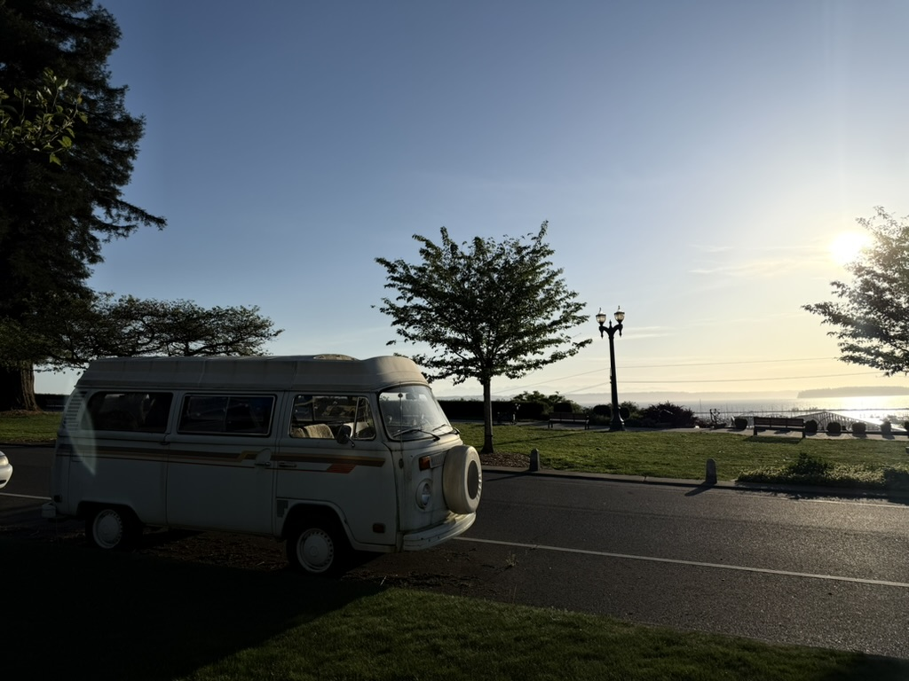

<section class="hero" aria-labelledby="page-title">
  

    
zeanrovin / personal/technical dump writing 

    <h1 id="page-title">Thoughtful notes for the curious web.</h1>
    

      I write about technology, learning, and the small details that make digital
      products feel better.
    

    <a class="jump-link" href="#latest">Read the latest ↓</a>
  

  <figure class="hero-image" aria-hidden="true">
    
  </figure>
</section>

<section class="about" id="about" aria-labelledby="about-title">
  

    
01 / ABOUT

    <h2 id="about-title">Who's writing this.</h2>
  

  

    

      I'm Rovin — a Technical Writer and Support Engineer based in Seattle, WA,
      currently working at Deloitte Consulting. I have 7+ years of experience
      translating complex engineering work into documentation that developers
      actually use.
    

    

      Most recently I led the migration of 31 products from WordPress to a
      Markdown and MkDocs docs-as-code workflow, built automated documentation
      pipelines, and drove Copilot adoption across my team's development process.
      I use Claude and other AI tools daily to accelerate documentation drafting,
      review, and architecture visualization.
    

    

      This site is where I write about documentation systems, developer
      experience, and the practical side of keeping technical content accurate
      and maintainable at scale. I'm a continuous learner — I try to get better
      at something every day, and I have the humility to learn from anyone
      around me.
    

    

      <a href="https://linkedin.com/in/zean-rovin-balita" target="_blank" rel="noopener">LinkedIn</a>
      <a href="https://github.com/zeanrovin" target="_blank" rel="noopener">GitHub</a>
    

  

</section>

<section class="latest" id="latest" aria-labelledby="latest-title">
  

    
02 / LATEST WRITING

    <h2 id="latest-title">Start here.</h2>
  

  <a class="article-card" href="migration/intro/">
    

      <time datetime="2026-07-14">JUL 14, 2026</time>
      6 MIN READ
    

    <h3>A practical guide to migrating documentation</h3>
    

      How to approach a documentation migration with docs as code: preserve what works, improve what doesn't, and ship changes with confidence.
    

    Read article →
  </a>
</section>