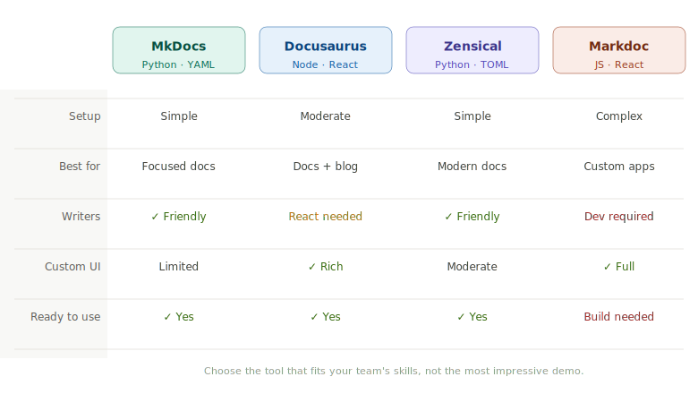

# Choosing a Docs-as-Code Tool: MkDocs vs. Docusaurus vs. Zensical vs. Markdoc

In the previous post, we moved legacy documentation into Markdown. The next decision is how to turn those files into a useful documentation site.

There is no universally best tool. The right choice depends on your team's skills, the kind of documentation you are publishing, how much visual customization you need, and how much engineering effort you want to invest in the site itself.

This post compares four common options: MkDocs, Docusaurus, Zensical, and Markdoc.


## The short version

| Tool | Best for | Main trade-off |
| --- | --- | --- |
| **MkDocs** | Teams that want a simple, Markdown-first static documentation site | Python-based configuration and a smaller application-development surface |
| **Docusaurus** | Developer-facing docs, product documentation, and sites that also need a blog or React components | Requires comfort with the Node.js and React ecosystem |
| **Zensical** | Teams that want a polished, batteries-included Markdown documentation experience with modern defaults | A newer project, so evaluate its ecosystem and migration needs carefully |
| **Markdoc** | Highly custom documentation experiences built as part of a web application | It is an authoring framework, not a complete documentation site generator |

The practical default is simple: choose **MkDocs** or **Zensical** for a focused documentation site; choose **Docusaurus** when your team already works in React or wants docs and a blog together; choose **Markdoc** when a standard documentation site is not enough and you need to build a custom content experience.

## Before comparing features, define your needs

Start with a few questions:

- Does the team already use Python or Node.js?
- Is the site primarily documentation, or will it also include a blog, marketing pages, or an application?
- Do authors need only Markdown, or reusable interactive components too?
- Do you need documentation versioning, localization, API reference, or a large plugin ecosystem?
- Who will maintain the site after launch: writers, developers, or both?

Avoid choosing a tool solely because its demo looks impressive. The important test is whether your team can update, review, build, and publish the documentation comfortably six months from now.


## Option 1: MkDocs

[MkDocs](https://www.mkdocs.org/) is a static-site generator built specifically for project documentation. Your source files live in a `docs/` directory and the site is configured in `mkdocs.yml`.

MkDocs is a good fit when you want a straightforward documentation workflow: write Markdown, preview locally, and publish static files. It is especially approachable for teams that prefer a lightweight Python-based toolchain.

### Choose MkDocs when

- You want a focused documentation site without building a web application.
- Your writers and developers are comfortable with Markdown and YAML.
- You value a small, understandable project structure.
- You want a mature, well-established documentation generator.

### Think twice when

- Your site needs deeply custom interactive experiences.
- Your team strongly prefers JavaScript or TypeScript tooling.
- You expect the documentation site to become a full product or marketing application.

### Get started with MkDocs

Install MkDocs, create a project, and run the local preview server:

```bash
python -m pip install mkdocs
mkdocs new product-docs
cd product-docs
mkdocs serve
```

Open the local address printed by the command—normally `http://127.0.0.1:8000`.

The starter project contains a `docs/` folder for Markdown files and an `mkdocs.yml` configuration file. Add a simple navigation structure:

```yaml
# mkdocs.yml
site_name: Product Documentation

nav:
  - Home: index.md
  - Getting started: getting-started.md
  - Reference: reference.md
```

Then add `docs/getting-started.md`:

````markdown
# Getting started

Install the CLI:

```bash
npm install -g example-cli
```

Run your first command:

```bash
example-cli init
```
````

Build the static site when you are ready to publish:

```bash
mkdocs build
```

> **[Image placeholder: screenshot of the MkDocs local preview and the `docs/` + `mkdocs.yml` project structure]**

## Option 2: Docusaurus

[Docusaurus](https://docusaurus.io/) is a static-site generator in the React ecosystem. It is designed for documentation sites, but it also includes a blog, custom pages, versioned docs, internationalization support, and React-based customization.

It is a natural choice for developer tools, open-source projects, or product teams that already build with JavaScript and React.

### Choose Docusaurus when

- Your team already uses Node.js, React, or TypeScript.
- You want documentation and a blog in one site.
- You need React components inside documentation pages.
- You expect to customize the site beyond a standard documentation layout.

### Think twice when

- The site is small and the team does not want to maintain a JavaScript project.
- Most maintainers are non-technical writers who do not have access to Node.js tooling.
- A standard static docs site is all you need.

### Get started with Docusaurus

Docusaurus requires Node.js 20 or newer. Create a starter site with the classic template:

```bash
npx create-docusaurus@latest product-docs classic --typescript
cd product-docs
npm run start
```

The starter creates a `docs/` directory for documentation pages, a `blog/` directory, and a `docusaurus.config.ts` configuration file.

Add a documentation page in `docs/getting-started.md`:

````markdown
---
sidebar_position: 1
---

# Getting started

Install the package:

```bash
npm install example-sdk
```

Create your first client:

```ts
import { Client } from 'example-sdk';

const client = new Client({ apiKey: process.env.EXAMPLE_API_KEY });
```
````

Use an MDX component when a page needs more than Markdown. For example, an inline callout can be written like this:

````mdx
import Tabs from '@theme/Tabs';
import TabItem from '@theme/TabItem';

<Tabs>
  <TabItem value="npm" label="npm" default>
    ```bash
    npm install example-sdk
    ```
  </TabItem>
  <TabItem value="pnpm" label="pnpm">
    ```bash
    pnpm add example-sdk
    ```
  </TabItem>
</Tabs>
````

Create a production build with:

```bash
npm run build
```

> **[Image placeholder: screenshot of a Docusaurus page with left navigation, version selector, and code tabs]**

## Option 3: Zensical

[Zensical](https://zensical.org/) is a modern static-site generator for project documentation, built by the creators of Material for MkDocs. It follows a Markdown-first workflow while providing polished defaults and uses `zensical.toml` for configuration.

Zensical is particularly interesting for teams that want a highly capable documentation experience without assembling a large set of themes and plugins themselves. It is newer than MkDocs and Docusaurus, which makes a small proof of concept especially worthwhile before committing a large migration.

### Choose Zensical when

- You want strong documentation-focused defaults and a polished interface.
- You prefer a Markdown-first static site rather than a React application.
- You like TOML configuration and a modern documentation workflow.
- You are willing to validate a newer tool against your requirements.

### Think twice when

- You rely on a specific MkDocs plugin that has not been validated for Zensical.
- Your organization requires a long-established ecosystem or has strict support requirements.
- You need native documentation versioning today; check the current versioning approach before committing.

### Get started with Zensical

Create a Python virtual environment, install Zensical, and scaffold a site:

```bash
python3 -m venv .venv
source .venv/bin/activate
pip install zensical

zensical new product-docs
cd product-docs
zensical serve
```

The generated project includes a `docs/` directory, a `zensical.toml` file, and a sample GitHub Actions workflow.

Configure the site in `zensical.toml`:

```toml
[project]
site_name = "Product Documentation"
site_url = "https://docs.example.com/"
```

Add a Markdown page in `docs/getting-started.md`:

```markdown
# Getting started

1. Install the command-line tool.
2. Authenticate with your account.
3. Create your first project.

> Tip: Keep each page focused on one task or concept.
```

Build the static site with:

```bash
zensical build
```

> **[Image placeholder: screenshot of a Zensical documentation site, showing its navigation and search experience]**

## Option 4: Markdoc

[Markdoc](https://markdoc.dev/) is different from the other three options. It is a Markdown-based authoring framework and toolchain, not a ready-made documentation-site generator. It gives developers more control over how content is parsed, transformed, and rendered in a custom application.

Markdoc is a strong fit when documentation needs custom components, structured content, and an interface that is unique to your product. That flexibility comes with more responsibility: you or your engineering team must supply the surrounding application, navigation, search, design system, and deployment approach.

### Choose Markdoc when

- Documentation is part of a custom React or web application.
- You need reusable structured tags and components beyond ordinary Markdown.
- You have engineering capacity to build and maintain the surrounding site.
- The user experience is a product requirement, not just a theme choice.

### Think twice when

- You need a documentation site running quickly with sensible defaults.
- You do not have a developer available to maintain the site application.
- Markdown authors should be insulated from application code and custom component decisions.

### Get started with Markdoc

Install Markdoc in an existing JavaScript or TypeScript application:

```bash
npm install @markdoc/markdoc
```

Create a Markdown file that uses a structured Markdoc tag:

```markdoc
# Configure your account


Keep your API key in an environment variable. Do not commit it to source control.

```

Then parse and transform the file in your application:

```ts
import Markdoc from '@markdoc/markdoc';

const source = '# Hello, Markdoc';
const ast = Markdoc.parse(source);
const content = Markdoc.transform(ast);

// Render `content` with the renderer for your application framework.
```

The key point is that Markdoc gives you the content layer. Unlike MkDocs, Docusaurus, and Zensical, it does not scaffold a full documentation website for you.

> **[Image placeholder: diagram showing Markdoc as the content layer inside a custom Next.js or React documentation application]**

## A practical selection guide

If you are still deciding, use this as a starting point:

- Choose **MkDocs** for a simple, mature, documentation-only static site.
- Choose **Docusaurus** if your team is already invested in React and needs docs, a blog, or rich components.
- Choose **Zensical** if you want an opinionated, polished Markdown documentation site and are comfortable evaluating a newer ecosystem.
- Choose **Markdoc** if you are building a custom documentation product rather than configuring a conventional documentation site.

For most teams starting a docs-as-code migration, a small proof of concept is better than a long comparison spreadsheet. Convert five to ten representative pages, build them in two candidate tools, and compare the real workflow:

- How easy is it to write and review a page?
- How well do tables, images, code samples, and callouts render?
- Can the team find and change navigation?
- How straightforward is preview, build, and deployment?
- How much custom work is required before the site feels ready to use?

The tool should support your documentation practice—not become the main project.

## Next up

With a tool selected, the next step is to organize the repository: page structure, navigation, images, front matter, contribution guidance, and an automated publishing workflow.
