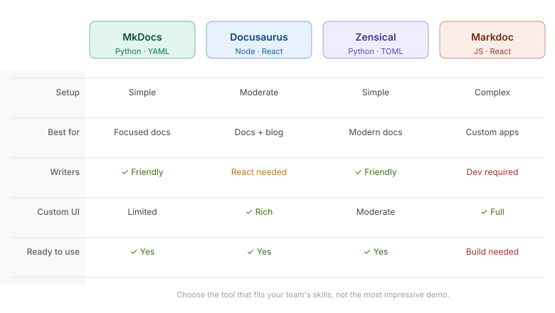
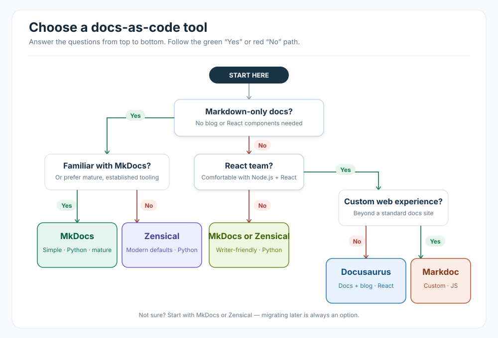
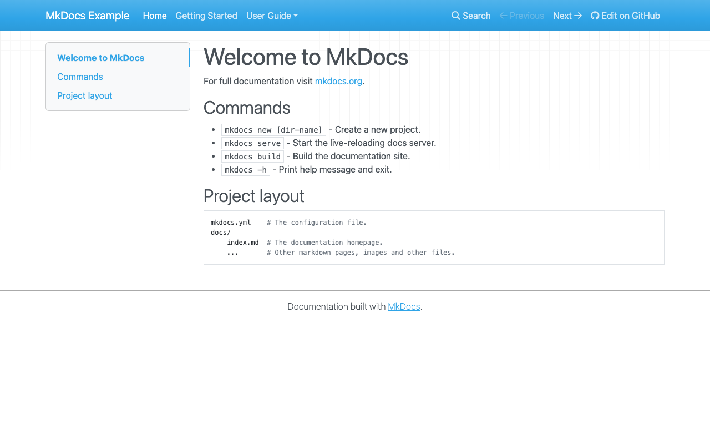
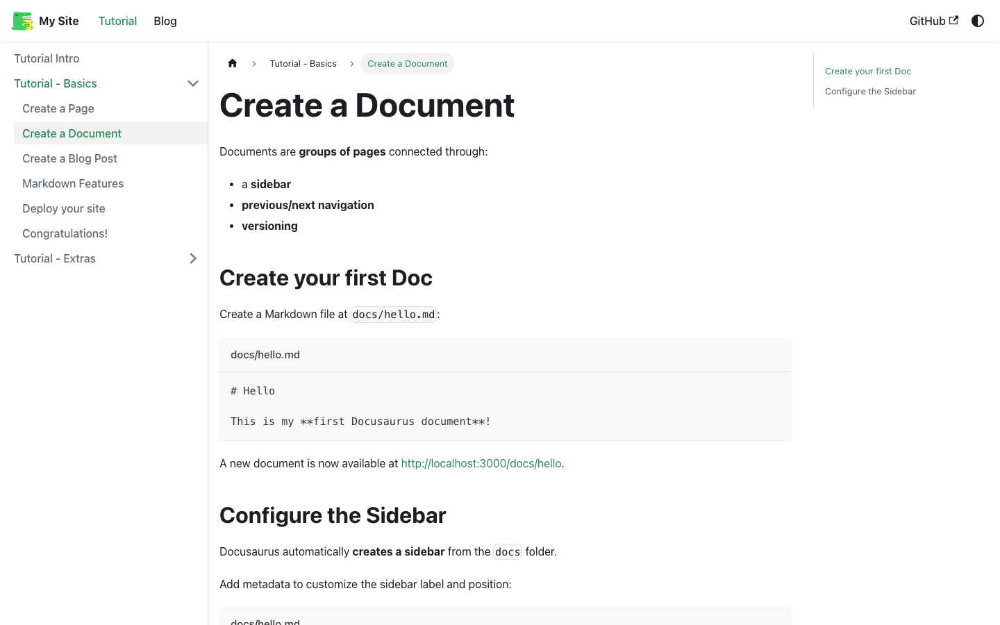
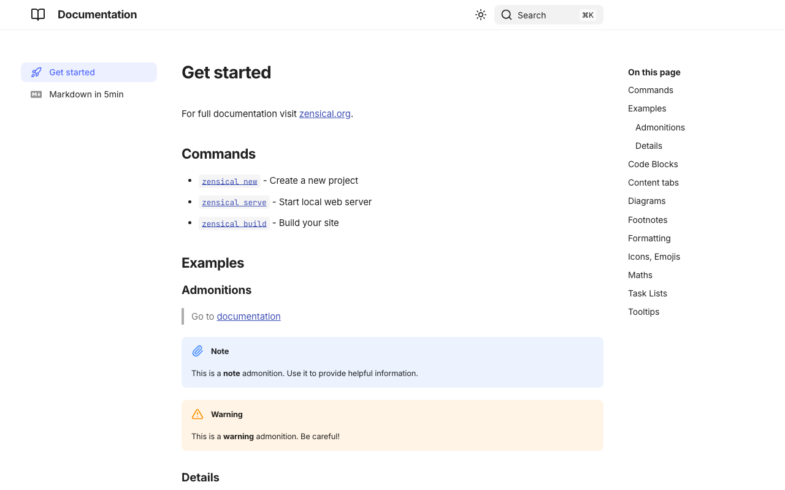
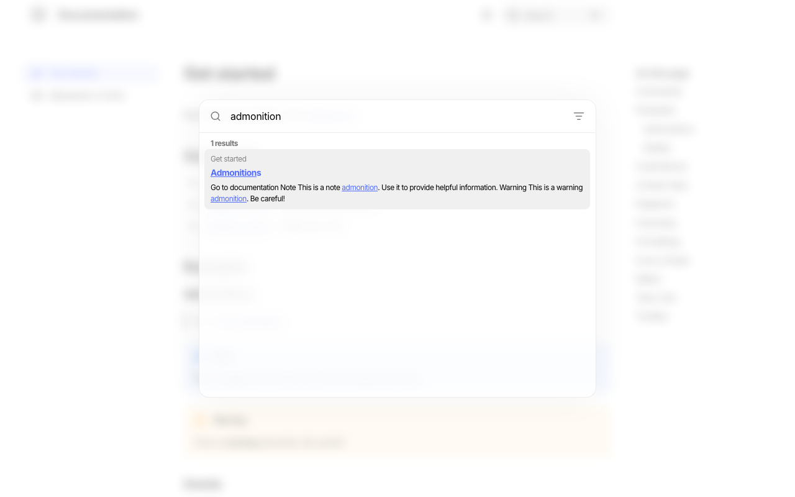
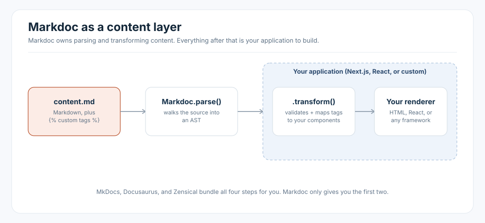

# Choosing a Docs-as-Code Tool: MkDocs vs. Docusaurus vs. Zensical vs. Markdoc

[Part 2](migration-process.md) got your documentation into Markdown. The next decision — what turns those files into an actual site — is the one people burn the most time on, usually by treating it like it deserves a spreadsheet and a committee.

It doesn't. There's no universally correct answer here; the right tool depends on what your team already knows, how much visual customization you actually need, and how much engineering effort you're willing to put into the site itself rather than the docs on it. This post compares four options I'd put on any shortlist: MkDocs, Docusaurus, Zensical, and Markdoc.



## The short version

| Tool | Best for | Main trade-off |
| --- | --- | --- |
| **MkDocs** | Teams that want a simple, Markdown-first static site | Python-based config, small application-development surface |
| **Docusaurus** | Developer docs, product docs, sites that also need a blog | Requires comfort with Node.js and React |
| **Zensical** | A polished, batteries-included Markdown experience with modern defaults | Newer project — check its ecosystem before committing |
| **Markdoc** | Highly custom documentation built into a web application | An authoring framework, not a complete site generator |

If you want the short version of the short version: **MkDocs** or **Zensical** for a focused docs site, **Docusaurus** if your team already lives in React or wants docs and a blog together, **Markdoc** only if a standard docs site genuinely isn't enough and you're building a custom content experience anyway.

## Before you compare features, define your needs

A few questions worth answering before you open a single tool's homepage:

- Does the team already use Python or Node.js day to day?
- Is this site purely documentation, or does it also need a blog, marketing pages, or an embedded application?
- Do authors need plain Markdown, or reusable interactive components too?
- Do you need versioning, localization, API reference generation, or a deep plugin ecosystem?
- Who maintains this site after launch — writers, developers, or both?

Don't pick a tool because its demo site looked good in a tab you had open for ten seconds. The real test is whether your team can still update, review, build, and publish comfortably six months from now, once the novelty's worn off.



## Option 1: MkDocs

[MkDocs](https://www.mkdocs.org/) is a static-site generator built specifically for project documentation. Source files live in a `docs/` directory; the whole site is configured in one `mkdocs.yml`.

It's the right call when your writers and developers are already comfortable with Markdown and YAML, you want a small project you can actually hold in your head, and you have no interest in maintaining a JavaScript build just to publish text. It's the wrong call if the site needs to grow into something closer to an application, or your team is going to resist a Python toolchain on principle. [The MkDocs deep dive](mkdocs-deep-dive.md) shows exactly how bare the default scaffold is — which reads as either refreshing or underwhelming depending on how much hand-holding you wanted.

### Get started with MkDocs

Install MkDocs, create a project, and run the local preview server:

```bash
python -m pip install mkdocs
mkdocs new product-docs
cd product-docs
mkdocs serve
```

Open the local address printed by the command — normally `http://127.0.0.1:8000`.

The starter project contains a `docs/` folder for Markdown files and an `mkdocs.yml` configuration file. Add a simple navigation structure:

```yaml
# mkdocs.yml
site_name: Product Documentation

nav:
  - Home: index.md
  - Getting started: getting-started.md
  - Reference: reference.md
```

Then add `docs/getting-started.md`:

````markdown
# Getting started

Install the CLI:

```bash
npm install -g example-cli
```

Run your first command:

```bash
example-cli init
```
````

Build the static site when you're ready to publish:

```bash
mkdocs build
```



*For a full walkthrough of what a stock MkDocs project looks like, see the [MkDocs Deep Dive](mkdocs-deep-dive.md).*

## Option 2: Docusaurus

[Docusaurus](https://docusaurus.io/) is a static-site generator in the React ecosystem. It's built for documentation, but it also ships a blog, custom pages, versioned docs, i18n, and full React-based customization.

It's the natural pick for developer tools, open-source projects, or product teams already building in JavaScript and React — the versioning and blog support in particular are hard to replicate elsewhere without a lot of custom tooling. It's the wrong pick for a small site whose maintainers are mostly non-technical writers with no reason to touch Node, or for anyone who just needs a standard docs site without the React project attached to it. [The Docusaurus deep dive](docusaurus-deep-dive.md) walks the classic template screen by screen, sidebars and blog included.

### Get started with Docusaurus

Docusaurus requires Node.js 20 or newer. Create a starter site with the classic template:

```bash
npx create-docusaurus@latest product-docs classic --typescript
cd product-docs
npm run start
```

The starter creates a `docs/` directory for documentation pages, a `blog/` directory, and a `docusaurus.config.ts` configuration file.

Add a documentation page in `docs/getting-started.md`:

````markdown
---
sidebar_position: 1
---

# Getting started

Install the package:

```bash
npm install example-sdk
```

Create your first client:

```ts
import { Client } from 'example-sdk';

const client = new Client({ apiKey: process.env.EXAMPLE_API_KEY });
```
````

Use an MDX component when a page needs more than Markdown. For example, an inline callout can be written like this:

````mdx
import Tabs from '@theme/Tabs';
import TabItem from '@theme/TabItem';

<Tabs>
  <TabItem value="npm" label="npm" default>
    ```bash
    npm install example-sdk
    ```
  </TabItem>
  <TabItem value="pnpm" label="pnpm">
    ```bash
    pnpm add example-sdk
    ```
  </TabItem>
</Tabs>
````

Create a production build with:

```bash
npm run build
```



*For a full walkthrough of the classic template's docs, blog, and navigation, see the [Docusaurus Deep Dive](docusaurus-deep-dive.md).*

## Option 3: Zensical

[Zensical](https://zensical.org/) is a modern static-site generator for project documentation, built by the team behind Material for MkDocs. It follows the same Markdown-first workflow, but with polished defaults baked in and `zensical.toml` in place of YAML.

It's worth a hard look when you want a genuinely capable documentation experience without assembling a pile of themes and plugins yourself — you'll notice this is the tool this site itself runs on. Being newer than MkDocs and Docusaurus is a real cost, though: run a small proof of concept before you commit a large migration to it, and check that any MkDocs plugin your team relies on has actually been validated here first. [The Zensical deep dive](zensical-deep-dive.md) covers what genuinely ships by default, including a CI deploy workflow neither of the other two tools bothers to include.

### Get started with Zensical

Create a Python virtual environment, install Zensical, and scaffold a site:

```bash
python3 -m venv .venv
source .venv/bin/activate
pip install zensical

zensical new product-docs
cd product-docs
zensical serve
```

The generated project includes a `docs/` directory, a `zensical.toml` file, and a sample GitHub Actions workflow.

Configure the site in `zensical.toml`:

```toml
[project]
site_name = "Product Documentation"
site_url = "https://docs.example.com/"
```

Add a Markdown page in `docs/getting-started.md`:

```markdown
# Getting started

1. Install the command-line tool.
2. Authenticate with your account.
3. Create your first project.

> Tip: Keep each page focused on one task or concept.
```

Build the static site with:

```bash
zensical build
```





*For a full walkthrough of what ships by default, see the [Zensical Deep Dive](zensical-deep-dive.md).*

## Option 4: Markdoc

[Markdoc](https://markdoc.dev/) doesn't belong on the same list as the other three, except that people keep putting it there. It's a Markdown-based authoring framework, not a ready-made documentation site — it hands you a parser and a transform step, and you build (or bolt it onto) everything else: navigation, search, design, deployment.

It earns its place when documentation needs custom components and structured content baked into a product's own application, and you have engineering capacity to actually build and maintain that surrounding site. Skip it if you just want a documentation site running quickly, or if your Markdown authors should stay insulated from application code. [The Markdoc deep dive](markdoc-deep-dive.md) builds this exact parse-transform-render pipeline by hand, with no framework hiding the seams.

### Get started with Markdoc

Install Markdoc in an existing JavaScript or TypeScript application:

```bash
npm install @markdoc/markdoc
```

Create a Markdown file that uses a structured Markdoc tag:

```markdoc
# Configure your account


Keep your API key in an environment variable. Do not commit it to source control.

```

Then parse and transform the file in your application:

```ts
import Markdoc from '@markdoc/markdoc';

const source = '# Hello, Markdoc';
const ast = Markdoc.parse(source);
const content = Markdoc.transform(ast);

// Render `content` with the renderer for your application framework.
```

The key point: Markdoc gives you the content layer. Unlike MkDocs, Docusaurus, and Zensical, it does not scaffold a full documentation website for you.



*For a hands-on build of this exact pipeline — parse, transform, render, with no framework in the way — see the [Markdoc Deep Dive](markdoc-deep-dive.md).*

## How I'd actually decide

Skip the comparison spreadsheet. Convert five to ten representative pages and build them in your top two candidates — you'll learn more from that afternoon than from another week of reading feature lists. Pay attention to how it actually feels to write and review a page, whether tables and code samples and callouts render the way you expect, whether anyone but you can find and change the navigation, and how much custom work stands between the scaffold and something you'd ship.

For what it's worth: the migration behind most of this series ran on MkDocs and Markdown, and the site you're reading this on runs on Zensical. Both were the right call for what they were solving — the tool should support the documentation practice, not become the project.

## What's Next

Parts 4 through 7 are the hands-on portion of this series — one deep dive per tool, each scaffolding a fresh project from zero and showing exactly what it gives you before a single line of customization:

- **[MkDocs Deep Dive](mkdocs-deep-dive.md)** — what a stock `mkdocs new` project gives you before you add a theme or plugins.
- **[Docusaurus Deep Dive](docusaurus-deep-dive.md)** — the `classic` template's docs, blog, and navigation, untouched.
- **[Zensical Deep Dive](zensical-deep-dive.md)** — what this site itself runs on, and what its scaffold ships with by default.
- **[Markdoc Deep Dive](markdoc-deep-dive.md)** — parsing and rendering Markdown by hand, with no framework in the way.

---

> This is part of a series on migrating legacy documentation to a docs-as-code workflow.
>
> - [Part 1: Why Your Documentation Is Failing Your Engineering Team](intro.md).
> - [Part 2: The Migration Process](migration-process.md).
> - **Part 3: Choosing the Right Tool — MkDocs vs Docusaurus vs Zensical vs Markdoc** ← you are here.
> - [Part 4: MkDocs Deep Dive](mkdocs-deep-dive.md).
> - [Part 5: Docusaurus Deep Dive](docusaurus-deep-dive.md).
> - [Part 6: Zensical Deep Dive](zensical-deep-dive.md).
> - [Part 7: Markdoc Deep Dive](markdoc-deep-dive.md).
> - [Part 8: Lessons Learned](lessons-learned.md).
