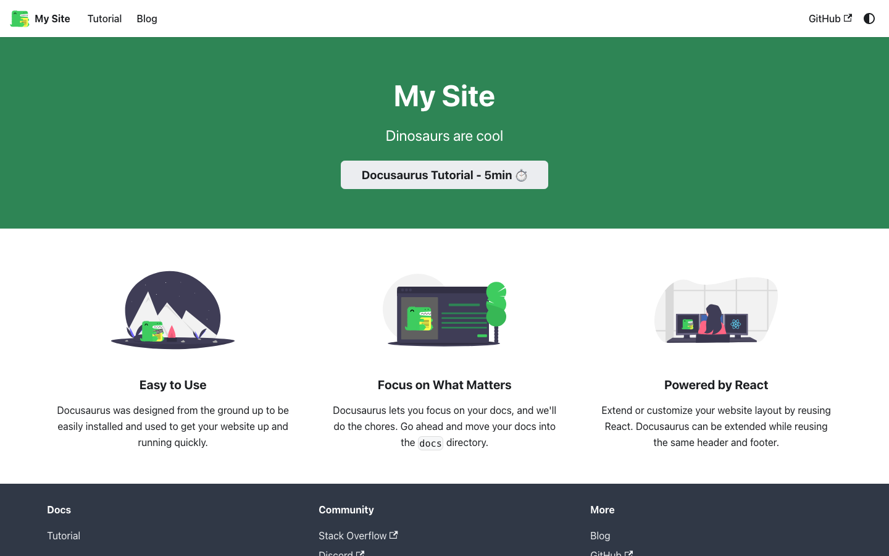
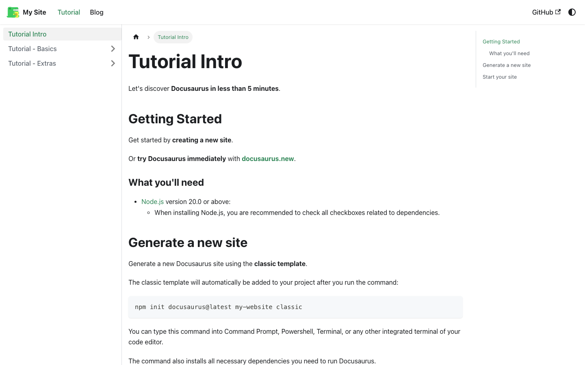
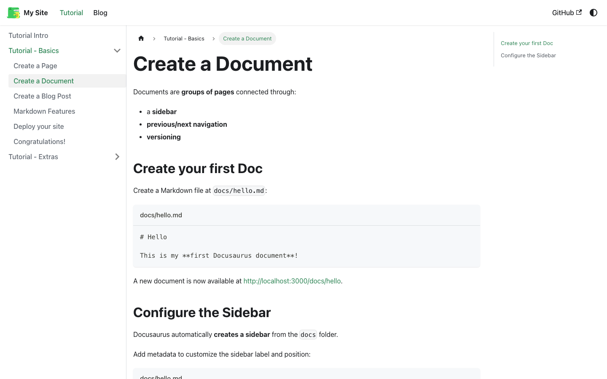
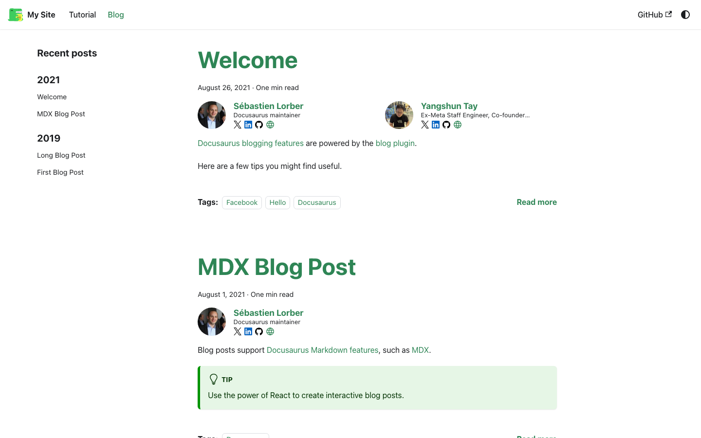

# A Docusaurus Deep Dive: What You Get Out of the Box

[Docusaurus](https://docusaurus.io/) is a React-based static site generator built specifically for documentation. Where a general-purpose framework like Next.js or Gatsby gives you a blank canvas, Docusaurus gives you a documentation site with sidebars, versioning, search, and MDX support already wired together — you're meant to focus on content, not scaffolding.

I wanted to see exactly what "out of the box" means in practice, so I scaffolded a fresh instance, ran it locally, and walked through it screen by screen. Everything below is a real running Docusaurus site — not marketing screenshots. The scaffold itself is public: **[zeanrovin/docusaurus-example](https://github.com/zeanrovin/docusaurus-example)**.

---

## Scaffolding a site

Per the [official installation docs](https://docusaurus.io/docs/installation), getting a project running is a two-command process:

```bash
npx create-docusaurus@latest my-website classic
cd my-website
npm start
```

The `classic` template is the one almost everyone starts with — it bundles the docs plugin, the blog plugin, and a default landing page into one project, rather than making you assemble them yourself. Docusaurus requires **Node.js 20.0 or above**.

Running `npm start` boots a local dev server with hot reload at `http://localhost:3000`. This is what the classic template's homepage looks like immediately after scaffolding, with zero customization:



That's a working, deployable site before you've written a single word of your own documentation.

## The docs experience

The real value of Docusaurus shows up once you open a docs page. This is the built-in tutorial's intro page:



Three things come free here, per the [docs guide](https://docusaurus.io/docs/docs-introduction):

- **Sidebar navigation**, auto-generated from your `docs/` folder structure — no manual nav config required, though you can override it in `sidebars.js`.
- **Breadcrumbs**, derived from the sidebar hierarchy.
- **A table of contents**, generated from the page's own headings.

Clicking into a nested page shows how the sidebar tracks the active section and how fenced code blocks render with a filename label, per Docusaurus's Markdown feature set:



That code block treatment — a filename header above a syntax-highlighted block — is a Docusaurus/MDX convention, not something you configure by hand.

## Blogging is a first-class citizen, not a bolt-on

Most documentation-focused generators either skip blogging entirely or treat it as an afterthought. Docusaurus's classic template ships a blog plugin by default, complete with author metadata, tags, and reading time:



This matters more than it sounds like it should. Release notes, migration announcements, and "why we changed X" posts all need a home, and bolting a separate blogging tool onto a docs site is exactly the kind of tooling fragmentation that [makes documentation harder to maintain over time](intro.md). Having it live in the same repo, build, and deploy as the docs means one less system to keep in sync.

## Core concepts worth knowing before you adopt it

A few concepts from the [official docs](https://docusaurus.io/docs) are worth understanding upfront, since they shape how much Docusaurus can do for you later:

**MDX.** Docusaurus content is written in [MDX](https://docusaurus.io/docs/markdown-features/react) — Markdown that can embed live React components. That's how features like tabbed code samples or interactive live editors work: they're just components dropped into a Markdown file.

**Sidebars.** Sidebar structure can be fully automatic (mirrored from your folder structure) or explicitly defined in `sidebars.js` for cases where you want a different order or grouping than your file tree implies.

**Versioning.** Docusaurus has [built-in doc versioning](https://docusaurus.io/docs/versioning) — you can snapshot the current docs as a version and keep publishing updates against a new one, with a version switcher generated automatically. This is the feature that matters most if you're documenting a product with multiple supported releases.

**i18n.** [Internationalization](https://docusaurus.io/docs/i18n/introduction) is built in rather than bolted on via a plugin, with per-locale content directories and a generated locale switcher.

## Where this fits

Docusaurus is a strong default when you want a documentation site backed by React and you're comfortable with the npm ecosystem — the versioning and i18n support in particular are hard to match without a lot of custom tooling. It's less appealing if you don't want a Node/React dependency in your publishing pipeline at all, which is where a Python-based generator like [MkDocs or Zensical](migration-process.md) — what this site itself runs on — starts to look more appealing.

For everything not covered here — deployment, plugin authoring, swizzling theme components — the [official documentation](https://docusaurus.io/docs) is thorough and worth reading directly rather than summarized.

## Try it yourself

The exact scaffold used for these screenshots — untouched `classic` template, nothing customized — is on GitHub:

**→ [github.com/zeanrovin/docusaurus-example](https://github.com/zeanrovin/docusaurus-example)**

Clone it, run `npm install && npm start`, and you'll be looking at the same site these screenshots came from.
