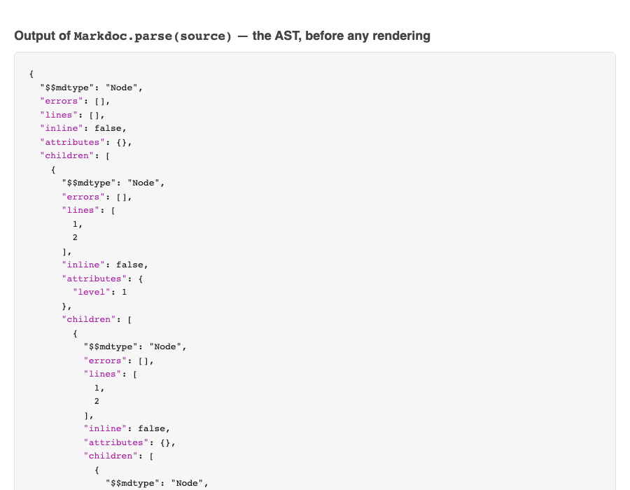

# A Markdoc Deep Dive: Parsing and Rendering Content From Scratch

Most docs-as-code tooling hides the pipeline from you. You write Markdown, run a build command, and a site appears. That's great for productivity, but it also means most people writing documentation have never actually seen what happens between "plain text" and "rendered page."

I wanted to see it. So I built a small project that uses [Markdoc](https://markdoc.dev/), Stripe's Markdown-based authoring framework, to parse content into an AST, transform it, and render it to HTML — with no framework, no bundler, and no magic in between.

This post walks through what I built and why. For the actual code, setup steps, and project structure, see the repository: **[zeanrovin/markdoc-example](https://github.com/zeanrovin/markdoc-example)**.

---

## Why Markdoc, specifically

Markdoc is different from most Markdown processors in that it's not trying to be a static site generator. It's a content layer: it parses Markdown into an AST, lets you validate and transform that AST, and hands you the pieces to render however you want. That makes it a good fit for teams that need structured, component-rich content — custom tags for callouts, tabs, or embeds — without giving up plain Markdown as the authoring format.

The tradeoff is that Markdoc doesn't ship a publishing pipeline for you. You decide how source becomes output. That's exactly what made it worth building by hand once, instead of only ever consuming it through Next.js or another framework's integration.

## What the project actually does

The setup is intentionally minimal:

- A single `index.js` build script does the real work: it reads a Markdoc source string, parses it into an AST, transforms the AST, renders it to HTML, wraps the output in a basic page template, and writes the result to `index.html`.
- `live-server` serves that output locally and refreshes the browser automatically whenever the file changes.
- There's no framework layer, no routing, no bundler — just Node, Markdoc, and a build script you can read top to bottom in a few minutes.

The workflow while writing is equally simple: edit the `source` variable in `index.js`, run `node index.js` to regenerate `index.html`, and the browser picks up the change.

Here's the actual output — no template, no CSS framework, just the inline styles from `index.js` wrapping whatever `Markdoc.renderers.html()` produced:

## What this made visible

Working at this level made a few things click that stay invisible in a full framework:

**Parsing and rendering are separate steps.** Markdoc gives you an AST in between, which means you can inspect or modify content structurally before it ever becomes HTML. Dropping a `console.log(JSON.stringify(ast))` right after `Markdoc.parse(source)` makes that seam impossible to miss — the heading, paragraph, and list are all still distinct nodes with their own `attributes` and `lines`, with no HTML in sight yet:

That's the same idea behind lint rules, custom components, and content validation in larger docs platforms — you're just seeing the seam where it happens.

**A page template is just a wrapper.** Once you've rendered content to HTML, "the site" is really just that HTML dropped into a shell with some CSS. Every static site generator is doing a more elaborate version of the same thing.

**Minimal setups make expansion decisions visible.** The project's natural next steps — multiple pages from separate source files, routing via Next.js, custom Markdoc tags for things like callouts — aren't hidden by scaffolding. You can see exactly where each one would need to plug in.

## One thing worth flagging if you try this yourself

Don't clone the Markdoc repository itself as a starting point. Start a fresh project and install `@markdoc/markdoc` as a dependency via npm. The library is meant to be consumed, not forked, and starting fresh keeps the setup close to what you'd actually use in a real project.

## Where to go for the details

This post is the "why" and the "what it taught me." The "how" — exact commands, the full `index.js` script, and the project structure — lives in the repository itself:

**→ [github.com/zeanrovin/markdoc-example](https://github.com/zeanrovin/markdoc-example)**

If you're evaluating Markdoc for a docs-as-code migration, I'd start there before reaching for a framework integration. Seeing the raw pipeline once makes every higher-level tool built on top of it easier to reason about.

That's the last of the four tool deep dives. [Part 8: Lessons Learned](lessons-learned.md) closes out the series with what actually mattered once the migration was real.