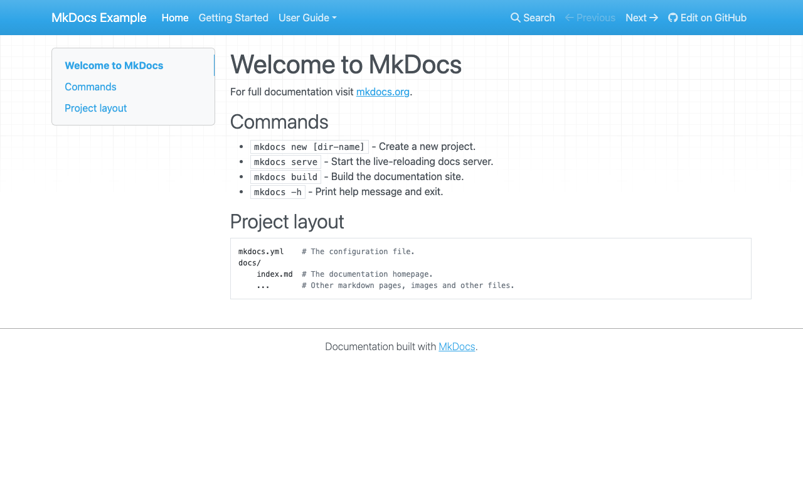
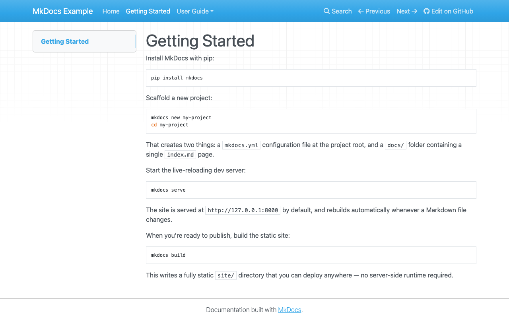
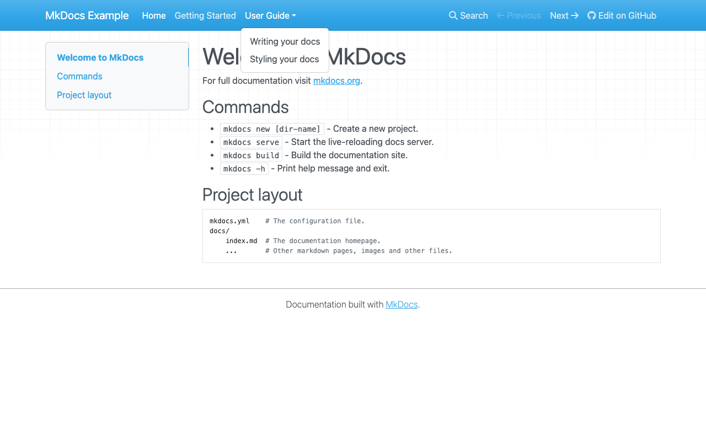
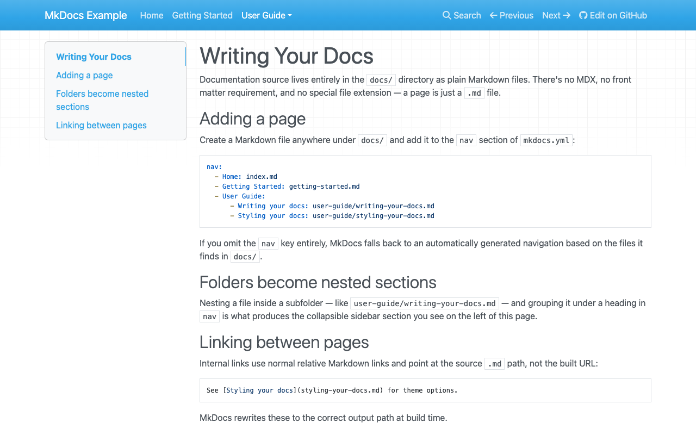
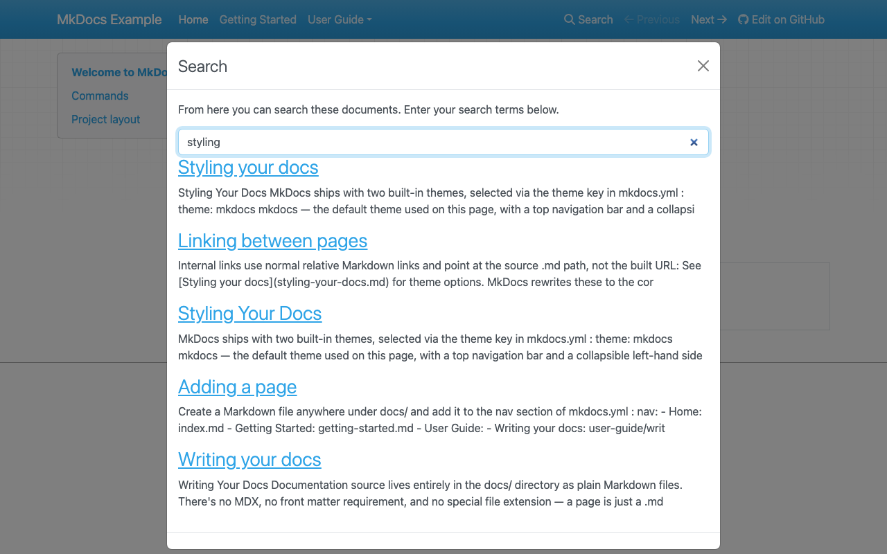

# A MkDocs Deep Dive: What You Get Out of the Box

[MkDocs](https://www.mkdocs.org/) is a Python-based static site generator built specifically for project documentation. Where Docusaurus wires an entire React app together for you, MkDocs takes the opposite approach: a single YAML config file, a folder of Markdown, and a minimal built-in theme — nothing else assumed.

I wanted to see exactly what "out of the box" means here too, so I scaffolded a fresh project, ran it locally, and walked through it screen by screen. Everything below is a real running MkDocs site — not marketing screenshots. The scaffold itself is public: **[zeanrovin/mkdocs-example](https://github.com/zeanrovin/mkdocs-example)**.

---

## Scaffolding a project

Per the [official getting started guide](https://www.mkdocs.org/getting-started/), MkDocs installs from PyPI and gets a project running in three commands:

```bash
pip install mkdocs
mkdocs new my-project
cd my-project
mkdocs serve
```

`mkdocs new` writes exactly two things: an `mkdocs.yml` config file at the project root, and a `docs/index.md` file. That's the entire scaffold — compare that to Docusaurus's `classic` template, which ships a docs plugin, a blog plugin, and a themed landing page already wired together. MkDocs assumes you'll build the rest yourself.

`mkdocs serve` boots a live-reloading dev server at `http://127.0.0.1:8000`. This is the default `mkdocs` theme rendering that single `index.md` file, with zero configuration beyond the scaffold:



That's a real, if bare, working site. There's no hero section and no feature cards — just the page you wrote, rendered.

## The docs experience — once you add pages

A single page doesn't show much, so ([per the docs](https://www.mkdocs.org/user-guide/writing-your-docs/)) I added a couple more pages and grouped two of them under a nested section in `mkdocs.yml`'s `nav`:

```yaml
nav:
  - Home: index.md
  - Getting Started: getting-started.md
  - User Guide:
      - Writing your docs: user-guide/writing-your-docs.md
      - Styling your docs: user-guide/styling-your-docs.md
```

This is where MkDocs's default layout differs from Docusaurus in a way worth calling out explicitly: the **top navbar** carries the site-wide navigation, with nested `nav` sections rendered as dropdowns, while the **left-hand column** is a table of contents scoped to the current page only — not a global sidebar tree the way Docusaurus's left sidebar is.



Clicking the "User Guide" dropdown shows how a nested `nav` entry actually renders — a standard dropdown menu, not a collapsible tree:



And on a page with more headings, that left column fills in as a genuine in-page table of contents, tracking the page's own section structure:



Two more things came free just from setting `repo_url` in `mkdocs.yml`: an **"Edit on GitHub"** link and **Previous / Next** page links, both visible in the navbar above — no plugin required.

## Search is built in, not bolted on

MkDocs indexes every page with [Lunr.js](https://lunrjs.com/) at build time and ships a search modal by default:



It's not instant-as-you-type the way Material for MkDocs' search is, and there's no fuzzy-matching tuning exposed, but it works immediately, offline, on nothing more than a plain `pip install mkdocs`.

## Core concepts worth knowing before you adopt it

**Two built-in themes.** `mkdocs` (used above) and `readthedocs` both ship inside the `mkdocs` package itself — no extra install, just a `theme:` key in `mkdocs.yml`. Almost every real-world MkDocs site, though, swaps in a third-party theme instead.

**Material for MkDocs.** [squidfunk.github.io/mkdocs-material](https://squidfunk.github.io/mkdocs-material/) is the de facto standard theme — by far the most popular way to run MkDocs in production, and built by the same team behind [Zensical](migration-process.md), what this site itself runs on. It adds instant search, dark mode, and a large library of Markdown extensions (admonitions, tabs, code annotations) that plain MkDocs doesn't have. Switching to it is a one-line `theme: name: material` change, not a migration. Its plugin ecosystem is the real draw: things like `mkdocs-material[imaging]` for social preview cards, `mkdocs-git-revision-date-localized-plugin` for last-updated timestamps, blog and tags plugins, and `mkdocstrings` for auto-generated API reference all drop into `mkdocs.yml` with a few lines of config — genuinely easy to assimilate into an existing set of docs rather than something you have to architect around.

**`nav` is optional.** Omit it entirely and MkDocs derives navigation from your file tree automatically — useful for getting started, less useful once you want a deliberate reading order instead of alphabetical files.

**A thinner plugin system than it looks.** MkDocs has a plugin API, but most of what people mean when they say "MkDocs" in production is actually MkDocs plus [mkdocs-material](https://squidfunk.github.io/mkdocs-material/) plus a handful of extensions — not the base tool used alone.

## Where this fits

MkDocs is the strongest default when you want the smallest possible amount of tooling between Markdown and a deployed documentation site, and you're fine with a Python toolchain instead of a Node one. It's less turnkey than Docusaurus straight out of the scaffold — you'll likely add a theme and a couple of plugins before it feels "finished" — but that also means less to configure, version, and upgrade later. If you want most of MkDocs's simplicity with a more polished default experience, [Zensical](migration-process.md) is worth a look; if you want React, MDX, versioning, and a blog wired together from the start, that's [Docusaurus's](docusaurus-deep-dive.md) territory.

For everything not covered here — deployment, the plugin API, writing a custom theme — the [official documentation](https://www.mkdocs.org/) is thorough and worth reading directly rather than summarized.

## Try it yourself

The exact scaffold used for these screenshots — the default `mkdocs new` project plus the two extra pages needed to demonstrate nav and search — is on GitHub:

**→ [github.com/zeanrovin/mkdocs-example](https://github.com/zeanrovin/mkdocs-example)**

Clone it, run `pip install mkdocs && mkdocs serve`, and you'll be looking at the same site these screenshots came from.
