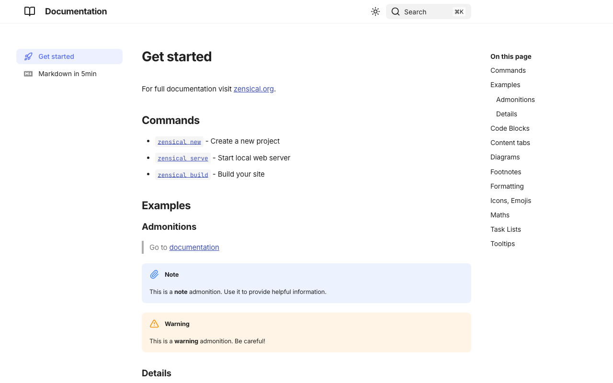
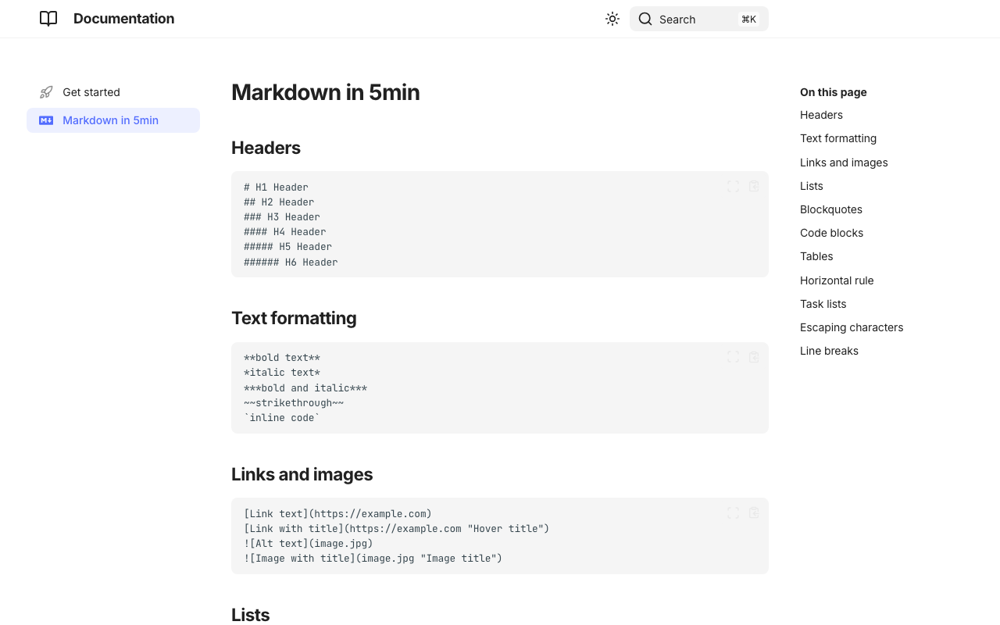
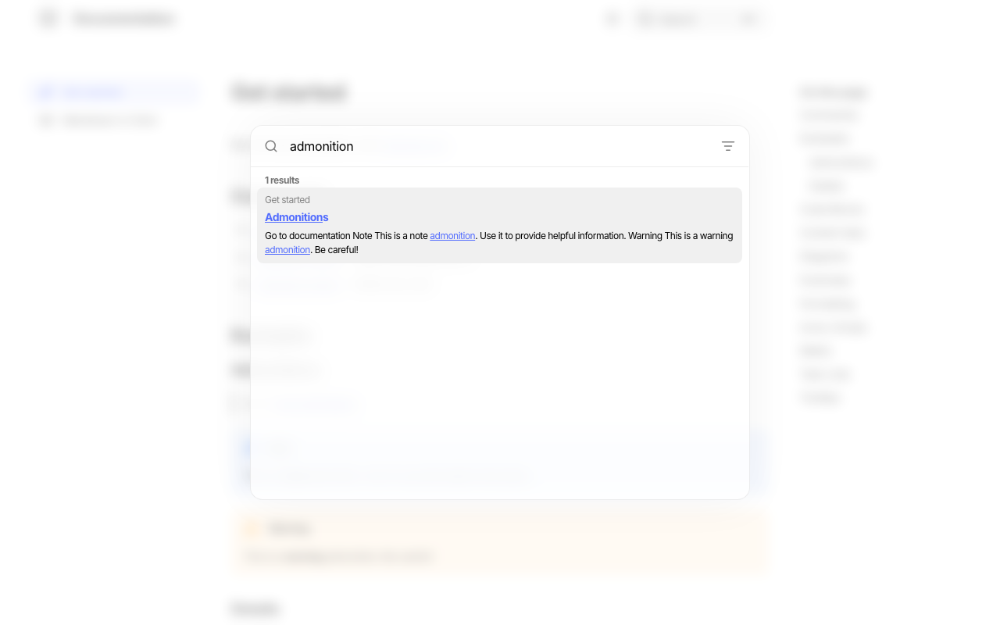

# A Zensical Deep Dive: What You Get Out of the Box

[Zensical](https://zensical.org/) is a static site generator for documentation built by the same team behind [Material for MkDocs](https://squidfunk.github.io/mkdocs-material/) — this time, though, the polished theme and the extensions it usually takes a config file full of plugins to assemble are the default, not an add-on.

This site itself runs on Zensical, so I already knew the destination. What I hadn't done was scaffold a project from zero and walk through exactly what you get before you've customized anything — the same exercise as the [MkDocs](mkdocs-deep-dive.md) and [Docusaurus](docusaurus-deep-dive.md) deep dives. Everything below is a real running Zensical site, untouched. The scaffold itself is public: **[zeanrovin/zensical-example](https://github.com/zeanrovin/zensical-example)**.

---

## Scaffolding a project

Per the [official docs](https://zensical.org/docs/usage/new/), Zensical installs from PyPI and mirrors MkDocs's own command names — deliberately, so switching between the two tools doesn't mean relearning a CLI:

```bash
pip install zensical
zensical new my-project
cd my-project
zensical serve
```

`zensical new` writes three things: a `zensical.toml` config file, a `docs/` folder with a starter `index.md` and `markdown.md`, and — unlike MkDocs or Docusaurus — a ready-to-use `.github/workflows/docs.yml` that builds the site and deploys it to GitHub Pages on every push to `main`. Neither of the other two tools ships a CI workflow in their default scaffold; Zensical treats "deployed" as part of "out of the box," not a follow-up step.

`zensical serve` boots a live-reloading dev server at `http://localhost:8000`. This is the default theme rendering the scaffolded `index.md`, with nothing customized:



Compare that to a stock `mkdocs new` project, which renders a single unstyled page with no admonitions, no syntax-highlighted code blocks, and no table of contents until you add a theme and extensions yourself. Zensical's scaffold arrives with all of that already on.

## The docs experience

Clicking into the second scaffolded page, `markdown.md`, is effectively a tour of what's enabled by default — headers, text formatting, links, and fenced code blocks with a copy button and a fullscreen toggle, all rendered without touching a config file:



The right-hand table of contents in both screenshots is generated from the page's own headings, and the left sidebar is the site-wide nav — the same two-sidebar layout Docusaurus uses, and notably not the top-navbar-plus-page-TOC layout plain MkDocs defaults to. That's not a coincidence: it's the same interaction model Material for MkDocs popularized, just without needing to install or configure it.

## Search, without a plugin

Search is a shadow-DOM component that opens from the header button (or the `⌘K` / `Ctrl+K` shortcut shown right on the button itself) and filters as you type:



No search plugin, no separate index-build step to configure — it's part of the same `zensical build` that generates the rest of the site.

## Core concepts worth knowing before you adopt it

**TOML, not YAML.** Configuration lives in `zensical.toml` instead of `mkdocs.yml`. The structure maps closely to MkDocs's config, which is intentional — the [migration path from MkDocs](migration/migration-process.md) is meant to be close to mechanical.

**Extensions are on by default.** Admonitions, collapsible details blocks, content tabs, diagrams, footnotes, task lists, and math all worked in the scaffold above with zero `markdown_extensions` configuration. In plain MkDocs, each of those is a separate opt-in extension you add and configure by hand.

**Deployment ships with the scaffold.** The included `docs.yml` GitHub Actions workflow runs `pip install zensical`, `zensical build --clean`, and deploys the `site/` output to GitHub Pages. It's the one part of this walkthrough that isn't a screenshot — there's nothing to see locally, it just means a fresh project is one `git push` away from a live site.

**It's still just Markdown in a `docs/` folder.** Despite the richer defaults, the authoring model is unchanged from MkDocs: plain `.md` files, a `nav` you can define explicitly or let Zensical infer from the file tree, no MDX or React in the loop.

## Where this fits

Zensical is the strongest default when you want most of what Material for MkDocs gives a mature MkDocs site — theme, search, extensions, dark mode — without assembling it yourself, and you're comfortable adopting a newer, faster-moving tool to get it. It's a more opinionated starting point than [plain MkDocs](mkdocs-deep-dive.md), which asks you to add a theme and extensions deliberately, and it's still a Python/Markdown workflow rather than the React/MDX one [Docusaurus](docusaurus-deep-dive.md) commits you to.

For everything not covered here — the full extension list, custom theming, versioning support — the [official documentation](https://zensical.org/docs/) is worth reading directly.

## Try it yourself

The exact scaffold used for these screenshots — untouched `zensical new` output, nothing customized — is on GitHub:

**→ [github.com/zeanrovin/zensical-example](https://github.com/zeanrovin/zensical-example)**

Clone it, run `pip install zensical && zensical serve`, and you'll be looking at the same site these screenshots came from.
